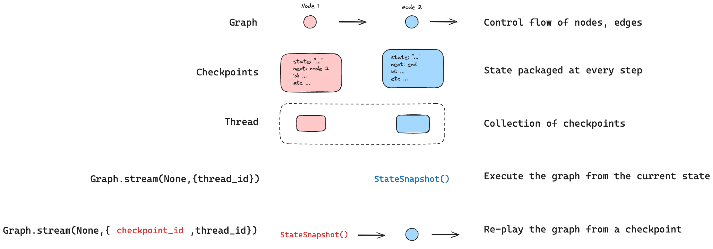

# Time Travel ⏱️

!!! note "Prerequisites"

    This guide assumes that you are familiar with LangGraph's checkpoints and states. If not, please review the [persistence](./persistence.md) concept first.


When working with non-deterministic systems that make model-based decisions (e.g., agents powered by LLMs), it can be useful to examine their decision-making process in detail:

1. 🤔 **Understand Reasoning**: Analyze the steps that led to a successful result.
2. 🐞 **Debug Mistakes**: Identify where and why errors occurred.
3. 🔍 **Explore Alternatives**: Test different paths to uncover better solutions.

We call these debugging techniques **Time Travel**, composed of two key actions: [**Replaying**](#replaying) 🔁 and [**Forking**](#forking) 🔀 .

## Replaying



Replaying allows us to revisit and reproduce an agent's past actions. This can be done either from the current state (or checkpoint) of the graph or from a specific checkpoint.

To replay from the current state, simply pass `None` as the input along with a `thread`:

```python
thread = {"configurable": {"thread_id": "1"}}
for event in graph.stream(None, thread, stream_mode="values"):
    print(event)
```

To replay actions from a specific checkpoint, start by retrieving all checkpoints for the thread:

```python
all_checkpoints = []
for state in graph.get_state_history(thread):
    all_checkpoints.append(state)
```

Each checkpoint has a unique ID. After identifying the desired checkpoint, for instance, `xyz`, include its ID in the configuration:

```python
config = {'configurable': {'thread_id': '1', 'checkpoint_id': 'xyz'}}
for event in graph.stream(None, config, stream_mode="values"):
    print(event)
```

The graph efficiently replays previously executed nodes instead of re-executing them, leveraging its awareness of prior checkpoint executions.

## Forking


Forking allows you to revisit an agent's past actions and explore alternative paths within the graph.

To edit a specific checkpoint, such as `xyz`, provide its `checkpoint_id` when updating the graph's state:

```python
config = {"configurable": {"thread_id": "1", "checkpoint_id": "xyz"}}
graph.update_state(config, {"state": "updated state"})
```

This creates a new forked checkpoint, xyz-fork, from which you can continue running the graph:

```python
config = {'configurable': {'thread_id': '1', 'checkpoint_id': 'xyz-fork'}}
for event in graph.stream(None, config, stream_mode="values"):
    print(event)
```

## Additional Resources 📚

- [**Conceptual Guide: Persistence**](https://langchain-ai.github.io/langgraph/concepts/persistence/#replay): Read the persistence guide for more context on replaying.
- [**How to View and Update Past Graph State**](../how-tos/human_in_the_loop/time-travel.ipynb): Step-by-step instructions for working with graph state that demonstrate the **replay** and **fork** actions.
